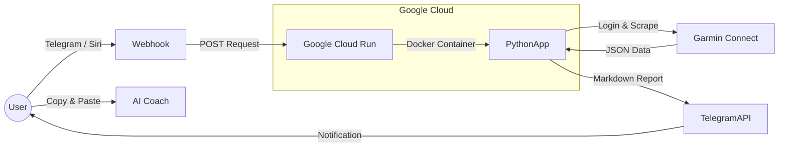

<!-- Pega esto al inicio del archivo en Inglés -->
[](README_ES.md)

# 🏃‍♂️ Garmin Telegram Bot (Serverless)

> **An advanced, fully serverless Telegram bot** that connects to the **private Garmin Connect API** to generate detailed sports reports and morning health metrics.

📦 **Infrastructure**: Google Cloud Run + Docker
💸 **Cost**: $0.00 USD (Free Tier)
🔁 **CI/CD**: Integrated with GitHub
🧠 **Output**: Technical Markdown reports ready for LLMs

---

## 💡 Origin: The Missing Link in *AI Coaching*

This project was born from a personal need: **training with an AI Coach (LLM)**.

Previously, the workflow was manual and tedious:

1. Finish a run
2. Take screenshots from the Garmin app
3. Upload them to an AI chat
4. Hope OCR didn’t hallucinate the data

👉 **This bot fully automates the process.**

It extracts **raw data (JSON)** directly from Garmin’s servers and generates a **pure Markdown technical report**, specifically structured to be copy-pasted into your LLM of choice:

* ChatGPT
* Claude
* Gemini

This allows your *AI Coach* to access deep metrics (**HRV, Efficiency Factor, real Splits**) **without hallucinations or OCR errors**.

---

## 🚀 Features

### 📊 1. Running Report (*“Coach Ready” Format*)

Send the activity index (`0` = latest, `1` = previous, etc.) and receive a deep analysis:

**Summary**

* Distance
* Time
* Pace
* GAP (Grade Adjusted Pace)
* Elevation gain

**Cardio**

* Average / Max Heart Rate
* Training Effect (Aerobic / Anaerobic)
* Training Load

**Zones**

* Percentage distribution by HR zones
* Dynamically detected zone ranges

**Efficiency**

* Efficiency Factor (EF)
* Power
* Calories

**Running Dynamics**

* Cadence
* Stride length
* GCT (Ground Contact Time)
* Vertical oscillation

**Splits (Laps)**

* Detailed lap-by-lap table
* Pace, HR, and EF per kilometer

---

### 🌅 2. Morning Health Report

Command: `morning`

Includes:

* 💤 Sleep: score, quality, and duration
* 🔋 Body Battery: max charge upon waking and current level
* ❤️ Heart: RHR and HRV
* ⚡ Readiness: training readiness score (0–100) with automatic advice

---

### 📋 3. Activity History

Command: `list` or `menu`

Displays the **last 5 activities** with:

* Date
* Type
* Distance

So you can easily choose which one to analyze.

---

### 🎤 4. Siri / iOS Shortcuts Support

Endpoint compatible with **GET requests**, perfect for iOS Shortcuts:

> *“Hey Siri, today’s report”*

---

## 🛠️ Architecture

**Event-driven, serverless architecture**:



---

## ⚙️ Prerequisites

### 🏃 Garmin

* Garmin Connect account
* Email and password

### 🤖 Telegram

1. Talk to `@BotFather`
2. Create a new bot
3. Obtain the **TOKEN**

### ☁️ Google Cloud Platform

* Active account
* Enabled APIs:

  * Cloud Run API
  * Cloud Build API

---

## 🚀 Installation & Deployment (Step by Step)

### 1️⃣ Repository Setup

Ensure the following files exist in your repo:

* `main.py` → bot logic
* `requirements.txt` → dependencies

  * `garminconnect`
  * `requests`
  * `functions-framework`
  * `garth`
* `Dockerfile` → Python 3.10 Slim with UTF-8 support

---

### 2️⃣ Deploy to Google Cloud Run

1. Go to **Google Cloud Console**
2. Click **Create Service**
3. Select **Continuously deploy from a repository**
4. Connect your GitHub repo

**Build**

* Build type: `Dockerfile`
* Source location: `/Dockerfile`

**Authentication**

* Allow unauthenticated invocations

**Environment Variables (CRITICAL)**
Under *Container → Networking → Security → Variables*:

```env
GARMIN_EMAIL=your_email
GARMIN_PASSWORD=your_password
TELEGRAM_TOKEN=your_token
```

5. Click **Create**

---

### 3️⃣ Configure the Telegram Webhook

After deployment, Google will provide a URL like:

```
https://garmin-bot-xyz.a.run.app
```

Open this in your browser:

```
https://api.telegram.org/bot<TOKEN>/setWebhook?url=<YOUR_GOOGLE_CLOUD_URL>
```

If you see:

```json
{"ok": true}
```

🎉 You’re good to go!

---

## 📱 Usage Guide

| Command   | Action                                  |
| --------- | --------------------------------------- |
| `morning` | Morning health report (Sleep, HRV, RHR) |
| `list`    | Show last 5 activities                  |
| `0`       | Analyze latest activity                 |
| `1`       | Analyze previous activity               |
| `n`       | Analyze activity *n*                    |

---

## 🤖 Siri Integration (Optional)

Create an iOS Shortcut:

* **URL**

  ```
  <YOUR_GOOGLE_URL>?siri=true&command=morning
  ```
* **Method**: `GET`
* **Action**:

  * Get contents of URL
  * Speak text

---

## ⚠️ Technical Notes

* **Filesystem**
  Google Cloud Run uses a *read-only* filesystem.
  The script applies:

  ```python
  os.environ["HOME"] = "/tmp"
  ```

  to allow session tokens to be stored temporarily.

* **Encoding**
  The Dockerfile enforces:

  ```
  LANG=C.UTF-8
  ```

  to correctly handle **accents and emojis** in logs and messages.

---

## 📄 License

This project is for **personal and educational use**.
Free to modify, extend, and improve.

---

Si quieres, el siguiente paso natural sería:

* Un **README bilingüe**
* Badges + screenshots para hacerlo más “open source friendly”
* O una versión **portfolio-level** para mostrarlo junto a tu perfil de ingeniería
Aquí tienes el **README completamente traducido al inglés**, manteniendo el **formato Markdown listo para copiar y pegar en GitHub**:

---

# 🏃‍♂️ Garmin Telegram Bot (Serverless)

> **An advanced, fully serverless Telegram bot** that connects to the **private Garmin Connect API** to generate detailed sports reports and morning health metrics.

📦 **Infrastructure**: Google Cloud Run + Docker
💸 **Cost**: $0.00 USD (Free Tier)
🔁 **CI/CD**: Integrated with GitHub
🧠 **Output**: Technical Markdown reports ready for LLMs

---

## 💡 Origin: The Missing Link in *AI Coaching*

This project was born from a personal need: **training with an AI Coach (LLM)**.

Previously, the workflow was manual and tedious:

1. Finish a run
2. Take screenshots from the Garmin app
3. Upload them to an AI chat
4. Hope OCR didn’t hallucinate the data

👉 **This bot fully automates the process.**

It extracts **raw data (JSON)** directly from Garmin’s servers and generates a **pure Markdown technical report**, specifically structured to be copy-pasted into your LLM of choice:

* ChatGPT
* Claude
* Gemini

This allows your *AI Coach* to access deep metrics (**HRV, Efficiency Factor, real Splits**) **without hallucinations or OCR errors**.

---

## 🚀 Features

### 📊 1. Running Report (*“Coach Ready” Format*)

Send the activity index (`0` = latest, `1` = previous, etc.) and receive a deep analysis:

**Summary**

* Distance
* Time
* Pace
* GAP (Grade Adjusted Pace)
* Elevation gain

**Cardio**

* Average / Max Heart Rate
* Training Effect (Aerobic / Anaerobic)
* Training Load

**Zones**

* Percentage distribution by HR zones
* Dynamically detected zone ranges

**Efficiency**

* Efficiency Factor (EF)
* Power
* Calories

**Running Dynamics**

* Cadence
* Stride length
* GCT (Ground Contact Time)
* Vertical oscillation

**Splits (Laps)**

* Detailed lap-by-lap table
* Pace, HR, and EF per kilometer

---

### 🌅 2. Morning Health Report

Command: `morning`

Includes:

* 💤 Sleep: score, quality, and duration
* 🔋 Body Battery: max charge upon waking and current level
* ❤️ Heart: RHR and HRV
* ⚡ Readiness: training readiness score (0–100) with automatic advice

---

### 📋 3. Activity History

Command: `list` or `menu`

Displays the **last 5 activities** with:

* Date
* Type
* Distance

So you can easily choose which one to analyze.

---

### 🎤 4. Siri / iOS Shortcuts Support

Endpoint compatible with **GET requests**, perfect for iOS Shortcuts:

> *“Hey Siri, today’s report”*

---

## 🛠️ Architecture

**Event-driven, serverless architecture**:


---

## ⚙️ Prerequisites

### 🏃 Garmin

* Garmin Connect account
* Email and password

### 🤖 Telegram

1. Talk to `@BotFather`
2. Create a new bot
3. Obtain the **TOKEN**

### ☁️ Google Cloud Platform

* Active account
* Enabled APIs:

  * Cloud Run API
  * Cloud Build API

---

## 🚀 Installation & Deployment (Step by Step)

### 1️⃣ Repository Setup

Ensure the following files exist in your repo:

* `main.py` → bot logic
* `requirements.txt` → dependencies

  * `garminconnect`
  * `requests`
  * `functions-framework`
  * `garth`
* `Dockerfile` → Python 3.10 Slim with UTF-8 support

---

### 2️⃣ Deploy to Google Cloud Run

1. Go to **Google Cloud Console**
2. Click **Create Service**
3. Select **Continuously deploy from a repository**
4. Connect your GitHub repo

**Build**

* Build type: `Dockerfile`
* Source location: `/Dockerfile`

**Authentication**

* Allow unauthenticated invocations

**Environment Variables (CRITICAL)**
Under *Container → Networking → Security → Variables*:

```env
GARMIN_EMAIL=your_email
GARMIN_PASSWORD=your_password
TELEGRAM_TOKEN=your_token
```

5. Click **Create**

---

### 3️⃣ Configure the Telegram Webhook

After deployment, Google will provide a URL like:

```
https://garmin-bot-xyz.a.run.app
```

Open this in your browser:

```
https://api.telegram.org/bot<TOKEN>/setWebhook?url=<YOUR_GOOGLE_CLOUD_URL>
```

If you see:

```json
{"ok": true}
```

🎉 You’re good to go!

---

## 📱 Usage Guide

| Command   | Action                                  |
| --------- | --------------------------------------- |
| `morning` | Morning health report (Sleep, HRV, RHR) |
| `list`    | Show last 5 activities                  |
| `0`       | Analyze latest activity                 |
| `1`       | Analyze previous activity               |
| `n`       | Analyze activity *n*                    |

---

## 🤖 Siri Integration (Optional)

Create an iOS Shortcut:

* **URL**

  ```
  <YOUR_GOOGLE_URL>?siri=true&command=morning
  ```
* **Method**: `GET`
* **Action**:

  * Get contents of URL
  * Speak text

---

## ⚠️ Technical Notes

* **Filesystem**
  Google Cloud Run uses a *read-only* filesystem.
  The script applies:

  ```python
  os.environ["HOME"] = "/tmp"
  ```

  to allow session tokens to be stored temporarily.

* **Encoding**
  The Dockerfile enforces:

  ```
  LANG=C.UTF-8
  ```

  to correctly handle **accents and emojis** in logs and messages.

---

## 📄 License

This project is for **personal and educational use**.
Free to modify, extend, and improve.
