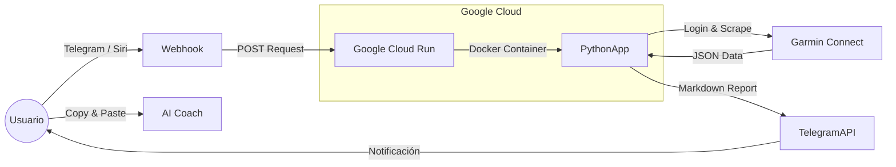

<!-- Pega esto al inicio del archivo en Inglés -->
[](README_ES.md)

# 🏃‍♂️ Garmin Telegram Bot (Serverless)

> **Un bot de Telegram avanzado y completamente Serverless** que se conecta a la **API privada de Garmin Connect** para generar reportes deportivos detallados y métricas de salud matutinas.

📦 **Infraestructura**: Google Cloud Run + Docker
💸 **Costo**: $0.00 USD (Free Tier)
🔁 **CI/CD**: Integrado con GitHub
🧠 **Output**: Reportes técnicos en Markdown listos para LLMs

---

## 💡 Origen: El eslabón perdido del *AI Coaching*

Este proyecto nació de una necesidad personal: **entrenar con un Coach de IA (LLM)**.

Antes, el flujo era manual y tedioso:

1. Terminar de correr
2. Tomar capturas de pantalla de Garmin
3. Subirlas a un chat de IA
4. Esperar que el OCR no alucinara datos

👉 **Este bot automatiza todo el proceso.**

Extrae los **datos crudos (JSON)** directamente de los servidores de Garmin y genera un **reporte técnico en Markdown puro**, estructurado específicamente para copiar y pegar en tu LLM de confianza:

* ChatGPT
* Claude
* Gemini

De esta forma, tu *Coach IA* accede a métricas profundas (**HRV, Efficiency Factor, Splits reales**) **sin alucinaciones ni errores de OCR**.

---

## 🚀 Características

### 📊 1. Reporte de Carrera (*Formato “Coach Ready”*)

Envía el índice de la actividad (`0` = última, `1` = anterior, etc.) y recibe un análisis profundo:

**Resumen**

* Distancia
* Tiempo
* Ritmo
* GAP (Ritmo Ajustado a Pendiente)
* Ascenso

**Cardio**

* FC Media / Máx
* Training Effect (Aeróbico / Anaeróbico)
* Carga de entrenamiento

**Zonas**

* Distribución porcentual por zonas de FC
* Rangos dinámicos detectados automáticamente

**Eficiencia**

* Efficiency Factor (EF)
* Potencia
* Calorías

**Dinámicas de Carrera**

* Cadencia
* Longitud de zancada
* GCT (Ground Contact Time)
* Oscilación vertical

**Splits (Vueltas)**

* Tabla vuelta por vuelta
* Ritmo, FC y EF por kilómetro

---

### 🌅 2. Reporte Matutino de Salud

Comando: `mañana` o `morning`

Incluye:

* 💤 Sueño: puntuación, calidad y duración
* 🔋 Body Battery: carga máxima al despertar y nivel actual
* ❤️ Corazón: RHR y HRV (VFC)
* ⚡ Readiness: disposición para entrenar (0–100) con consejo automático

---

### 📋 3. Historial de Actividades

Comando: `lista` o `menu`

Muestra las **últimas 5 actividades** con:

* Fecha
* Tipo
* Distancia

Para elegir fácilmente cuál analizar.

---

### 🎤 4. Soporte para Siri / Atajos (iOS)

Endpoint compatible con peticiones **GET**, ideal para Atajos de iOS:

> *“Oye Siri, reporte de hoy”*

---

## 🛠️ Arquitectura

Arquitectura **Event-Driven Serverless**:



---

## ⚙️ Requisitos Previos

### 🏃 Garmin

* Cuenta de **Garmin Connect**
* Email y contraseña

### 🤖 Telegram

1. Habla con `@BotFather`
2. Crea un bot nuevo
3. Obtén el **TOKEN**

### ☁️ Google Cloud Platform

* Cuenta activa
* APIs habilitadas:

  * Cloud Run API
  * Cloud Build API

---

## 🚀 Instalación y Despliegue (Paso a Paso)

### 1️⃣ Configuración del Repositorio

Asegúrate de tener estos archivos:

* `main.py` → lógica del bot
* `requirements.txt` → dependencias

  * `garminconnect`
  * `requests`
  * `functions-framework`
  * `garth`
* `Dockerfile` → Python 3.10 Slim con UTF-8

---

### 2️⃣ Despliegue en Google Cloud Run

1. Ve a **Google Cloud Console**
2. Click en **Create Service**
3. Selecciona **Continuously deploy from a repository**
4. Conecta tu repo de GitHub

**Build**

* Build type: `Dockerfile`
* Source location: `/Dockerfile`

**Autenticación**

* Allow unauthenticated invocations

**Variables de Entorno (CRÍTICO)**
En *Container → Networking → Security → Variables*:

```env
GARMIN_EMAIL=tu_correo
GARMIN_PASSWORD=tu_contraseña
TELEGRAM_TOKEN=tu_token
```

5. Click en **Create**

---

### 3️⃣ Configurar el Webhook de Telegram

Google te dará una URL como:

```
https://garmin-bot-xyz.a.run.app
```

Ejecuta en tu navegador:

```
https://api.telegram.org/bot<TU_TOKEN>/setWebhook?url=<TU_URL_DE_GOOGLE_CLOUD>
```

Si recibes:

```json
{"ok": true}
```

🎉 ¡Todo listo!

---

## 📱 Guía de Uso

| Comando  | Acción                             |
| -------- | ---------------------------------- |
| `mañana` | Reporte matutino (Sueño, HRV, RHR) |
| `lista`  | Menú de últimas 5 actividades      |
| `0`      | Analiza la última actividad        |
| `1`      | Analiza la anterior                |
| `n`      | Analiza la actividad n             |

---

## 🤖 Integración con Siri (Opcional)

Crea un Atajo en iOS:

* **URL**

  ```
  <TU_URL_GOOGLE>?siri=true&command=mañana
  ```
* **Método**: `GET`
* **Acción**:

  * Obtener contenido de URL
  * Leer texto

---

## ⚠️ Notas Técnicas

* **Sistema de archivos**
  Cloud Run es *read-only*.
  Se usa:

  ```python
  os.environ["HOME"] = "/tmp"
  ```

  para guardar tokens de sesión.

* **Codificación**
  El Dockerfile fuerza:

  ```
  LANG=C.UTF-8
  ```

  para soportar correctamente **acentos y emojis**.

---

## 📄 Licencia

Proyecto de **uso personal y educativo**.
Libre para modificar, extender y mejorar.

